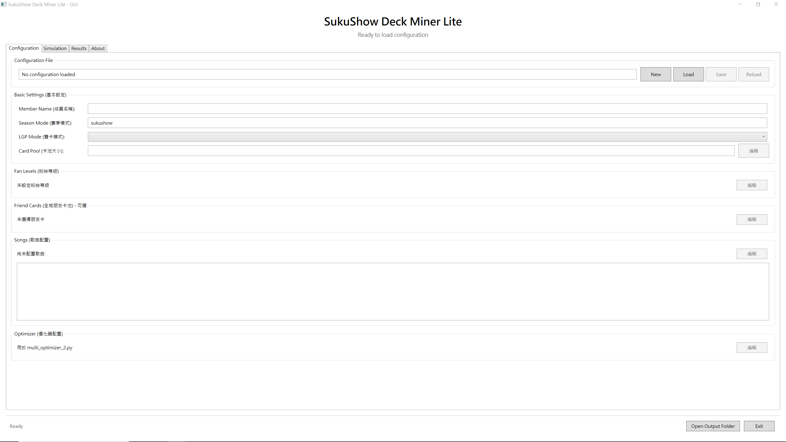
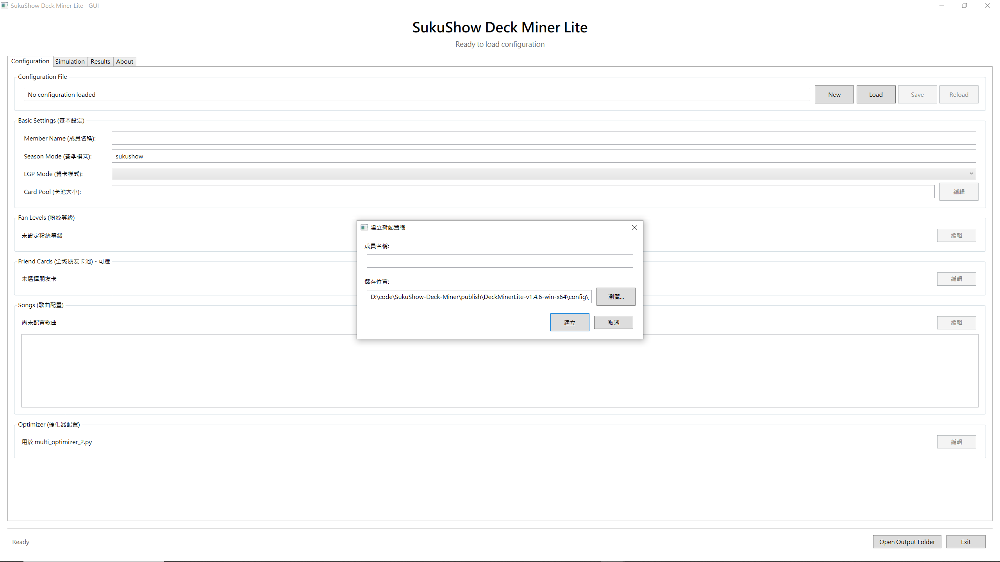
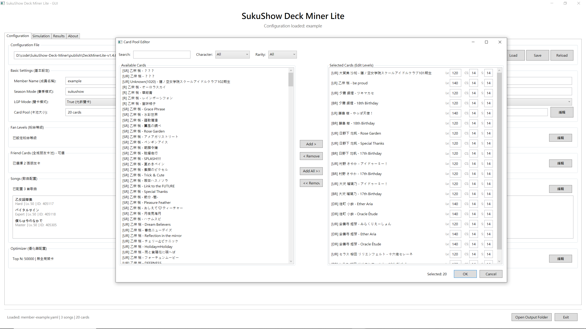
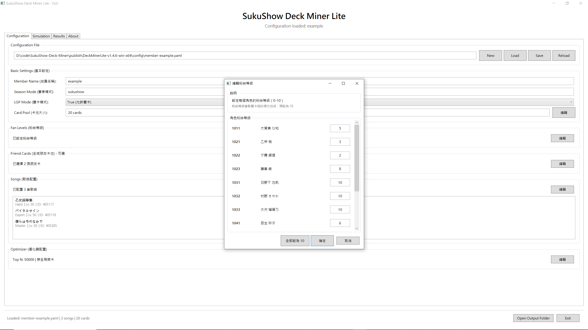
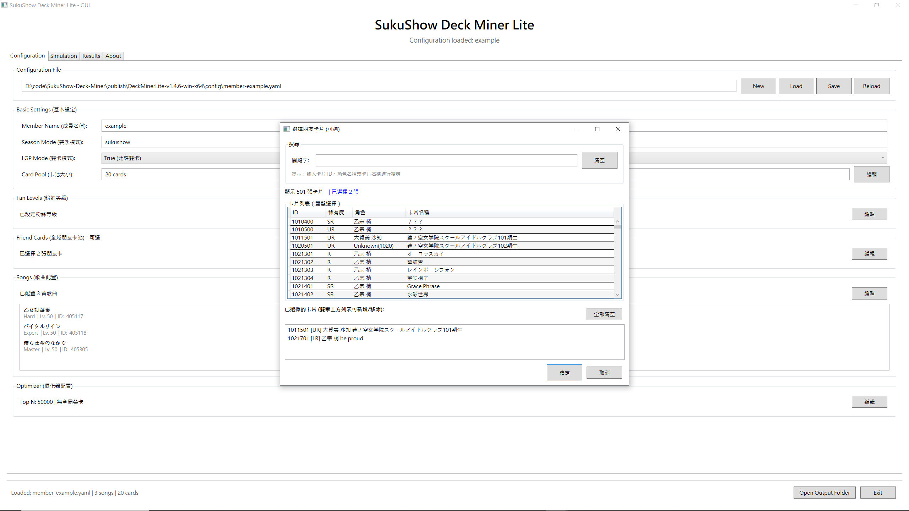
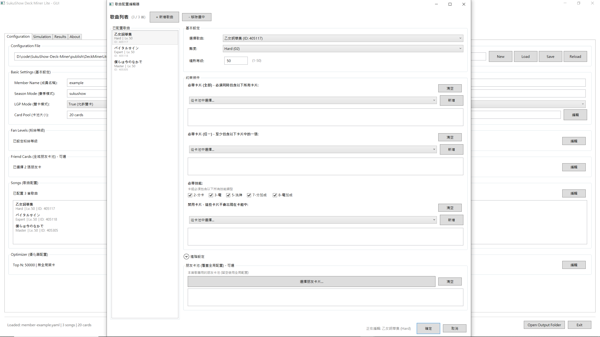
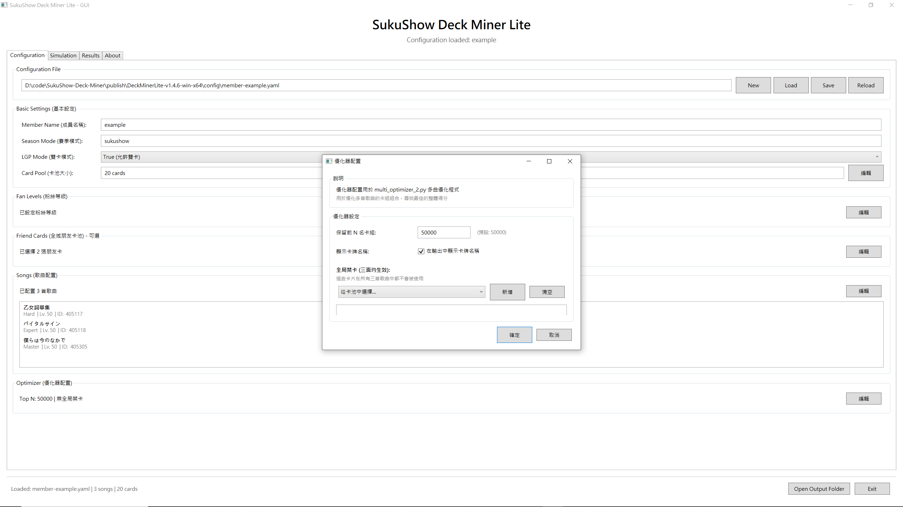
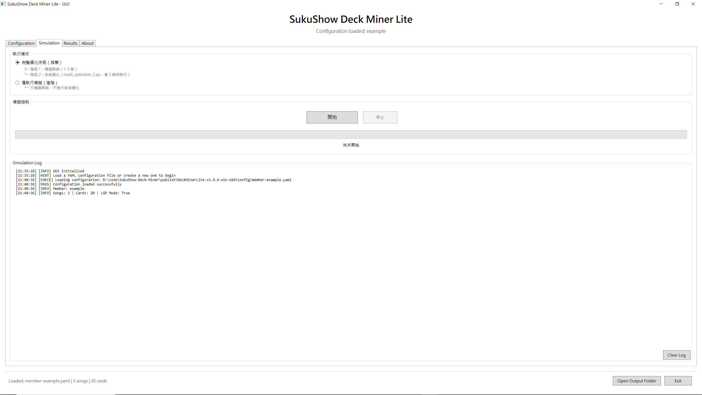
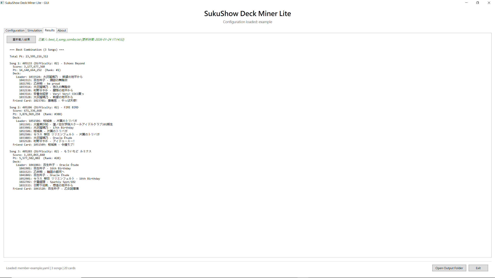

# SukuShow Deck Miner Lite 使用者指南

本指南將帶您一步步完成從安裝到執行模擬的完整流程。

---

## 目錄

1. [下載與安裝](#下載與安裝)
2. [快速開始](#快速開始)
3. [建立配置檔](#建立配置檔)
4. [設定卡池](#設定卡池)
5. [設定粉絲等級](#設定粉絲等級)
6. [設定全域朋友卡](#設定全域朋友卡)
7. [設定歌曲](#設定歌曲)
8. [設定優化器](#設定優化器)
9. [執行模擬](#執行模擬)
10. [查看結果](#查看結果)
11. [常見問題](#常見問題)

---

## 下載與安裝

### Windows 版本

1. 從 [Release 頁面](https://github.com/stu92054/DeckMinerLite/releases) 下載最新版本
2. 解壓縮 `DeckMinerLite-vX.X.X-win-x64.zip`
3. 雙擊 `DeckMinerLite.exe` 即可啟動

> **注意**：Windows 版本為獨立執行檔，不需要安裝 .NET 執行環境。

### Linux 版本

1. 下載 `DeckMinerLite-vX.X.X-linux-x64.tar`
2. 解壓縮並賦予執行權限：
   ```bash
   tar -xf DeckMinerLite-vX.X.X-linux-x64.tar
   chmod +x DeckMinerLite
   ```
3. 使用命令列執行：
   ```bash
   ./DeckMinerLite --config config/member-yourname.yaml
   ```

---

## 快速開始

啟動程式後，您會看到主介面：



介面分為四個分頁：
- **Configuration**：配置卡池、歌曲等設定
- **Simulation**：執行模擬
- **Results**：查看優化結果
- **About**：關於本程式

### 基本流程

```
建立/載入配置 → 設定卡池 → 設定歌曲 → 執行模擬 → 查看結果
```

---

## 建立配置檔

### 方式一：新建配置檔

1. 點擊右上角的 **New** 按鈕
2. 在彈出的對話框中輸入成員名稱（建議使用英文或數字）
3. 選擇儲存位置（預設為 `config/` 目錄）
4. 點擊 **建立**



### 方式二：載入現有配置檔

1. 點擊 **Load** 按鈕
2. 選擇 `.yaml` 配置檔
3. 配置內容會自動載入到介面

> **提示**：配置檔儲存在 `config/` 目錄下，檔名格式為 `member-{名稱}.yaml`

---

## 設定卡池

卡池是您擁有的所有卡牌，模擬器會從中挑選最佳組合。

1. 在 **Card Pool** 區塊點擊 **編輯** 按鈕
2. 開啟卡池編輯器



### 操作說明

| 區域 | 說明 |
|-----|------|
| 左側列表 | 遊戲中所有可用的卡牌 |
| 右側列表 | 您已選擇的卡牌（即您的卡池） |
| Search | 搜尋卡牌名稱 |
| Character | 按角色篩選 |
| Rarity | 按稀有度篩選（SR/UR/LR/BR/DR） |

### 新增卡牌

1. 在左側列表選擇卡牌（可多選）
2. 點擊 **Add >** 按鈕

### 移除卡牌

1. 在右側列表選擇卡牌
2. 點擊 **< Remove** 按鈕

### 設定卡牌練度

右側列表顯示的格式為：`[等級, 中心技能等級, 技能等級]`

- 預設為滿練度，等級依稀有度而定，技能等級上限為 14
- 若有未滿練度的卡牌，可手動調整

完成後點擊 **OK** 儲存。

---

## 設定粉絲等級

粉絲等級會影響 PT 計算的加成倍率。

1. 在 **Fan Levels** 區塊點擊 **編輯** 按鈕



### 操作說明

- 每個角色可設定 0-10 的粉絲等級
- 點擊 **全部設為 10** 可快速設定所有角色為滿級
- 完成後點擊 **確定**

> **提示**：Season Mode 設定為 `sukushow` 時，只計算歌唱成員的粉絲等級加成。

---

## 設定全域朋友卡

朋友卡是模擬時可借用的卡牌，為可選設定。

1. 在 **Friend Cards** 區塊點擊 **編輯** 按鈕



### 操作說明

- 在上方搜尋框輸入關鍵字篩選
- 雙擊卡牌加入已選擇列表
- 雙擊已選擇的卡牌可移除
- 點擊 **全部清空** 可清除所有選擇

> **注意**：朋友卡會在每首歌曲的模擬中被考慮，但每個卡組只能使用一張朋友卡。

> **提示**：建議這裡留空，在歌曲配置中設定單首歌曲的朋友卡以加速計算。

---

## 設定歌曲

歌曲配置決定要模擬哪些歌曲，以及各種約束條件。

1. 在 **Songs** 區塊點擊 **編輯** 按鈕



### 基本設定

| 欄位 | 說明 |
|-----|------|
| 歌曲 ID | 歌曲名稱與ID |
| 難度 | 01=Normal, 02=Hard, 03=Expert, 04=Master |
| 熟練度 | 0-50，影響最終分數加成|

### 進階設定

| 欄位 | 說明 |
|-----|------|
| 必須卡牌（全部） | 卡組必須包含所有指定卡牌 |
| 必須卡牌（任一） | 卡組必須包含至少一張指定卡牌 |
| 禁止卡牌 | 卡組不能包含這些卡牌 |
| 必帶技能 | 卡組中必須包含的技能(建議全選) |
| 好友卡（該首歌） | 針對該首歌指定可用的朋友卡 |

### 新增歌曲

1. 點擊 **+ 新增歌曲** 按鈕
2. 在左側列表選擇歌曲
3. 在右側設定詳細參數

### 移除歌曲

1. 選擇要移除的歌曲
2. 點擊 **刪除選取** 按鈕

> **重要**：多曲優化需要配置恰好 3 首歌曲。

---

## 設定優化器

優化器設定用於多曲優化階段。

1. 在 **Optimizer** 區塊點擊 **編輯** 按鈕



### 設定項目

| 欄位 | 說明 | 建議值 |
|-----|------|-------|
| 保留前 N 名卡組 | 每首歌保留得分最高的 N 個卡組 | 50000 |
| 顯示卡牌名稱 | 在輸出結果中顯示卡牌名稱 | 勾選 |
| 全局禁卡 | 三首歌都禁止使用的卡牌 | 依需求 |

> **提示**：Top N 值越大，優化結果越精確，但需要更多記憶體。

> **提示**：建議不要動這個區塊。

---

## 執行模擬

配置完成後，切換到 **Simulation** 分頁。



### 執行模式

| 模式 | 說明 |
|-----|------|
| **完整優化流程（推薦）** | 階段1: 模擬所有歌曲 → 階段2: 多曲優化找出最佳組合 |
| **僅執行模擬（進階）** | 只執行單曲模擬，不進行多曲優化 |

### 模擬策略

模擬器預設以全 Perfect+ 進行模擬。當卡組中包含特定卡牌時，會自動啟用壓血策略：

| 卡牌 | 壓血目標 |
|-----|---------|
| 輝跡の舞踏会 百生吟子 | 自動壓血至 10% |
| 16th Birthday 百生吟子 | 自動壓血至 25% |

> **說明**：這些卡牌的技能在低血量時有額外加成，模擬器會自動閒置以降低血量來最大化分數。

### 開始執行

1. 選擇執行模式
2. 點擊 **開始** 按鈕
3. 觀察日誌輸出和進度條
4. 等待執行完成

### 停止執行

- 點擊 **停止** 按鈕可中斷執行

### 日誌說明

```
[INFO]  - 一般資訊
[PASS]  - 操作成功
[FAIL]  - 操作失敗
[WARN]  - 警告訊息
[CHECK] - 正在檢查
```

---

## 查看結果

執行完成後，切換到 **Results** 分頁。



### 結果格式

```
=== Best Combination (3 Songs) ===
Total Pt: 23,595,216,312

Song 1: 405133 (Difficulty: 02) - Echoes Beyond
  Score: 3,177,677,368
  Pt: 14,160,664,252  (Rank: #1)
  Deck:
    Leader: 1033538: 大沢瑠璃乃 - 眺望の地平から
    1041513: 百生吟子 - 輝彩の舞踏会
    ...
  Friend Card: 1023701: 藤島慈 - やっぱ天使!
```

### 欄位說明

| 欄位 | 說明 |
|-----|------|
| Total Pt | 三首歌的 PT 總和 |
| Score | 該首歌的原始分數 |
| Pt | 計算加成後的 PT |
| Rank | 在該首歌的排名 |
| Leader | C 位卡牌 |
| Deck | 卡組成員 |
| Friend Card | 使用的朋友卡 |

### 重新載入結果

- 點擊 **重新載入結果** 按鈕可更新顯示

---

## 常見問題

### Q: 為什麼找不到某張卡牌？

**A**: 請確認：
1. 卡牌資料是否為最新版本
2. 篩選條件是否正確（角色、稀有度）

### Q: 模擬很慢怎麼辦？

**A**: 模擬速度取決於：
- 卡池大小（卡牌越多，組合越多）
- 約束條件（約束越少，組合越多）
- CPU 效能

建議：
- 減少卡池中的低稀有度卡牌
- 使用必須卡牌約束減少搜索空間

### Q: 多曲優化沒有執行？

**A**: 多曲優化需要恰好配置 3 首歌曲。若只有 1-2 首歌，會跳過優化階段。

### Q: 結果檔案在哪裡？

**A**:
- 單曲模擬結果：`log/{成員名稱}/simulation_results_{歌曲ID}_{難度}.json`
- 多曲優化結果：`best_3_song_combo.txt`

點擊主介面右下角的 **Open Output Folder** 可快速開啟輸出目錄。

### Q: 如何更新卡牌資料？

**A**: 將最新的 `CardDatas.json` 和 `Musics.yaml` 放入 `GameData/` 目錄即可。

### Q: Console 輸出亂碼？

**A**: 程式已自動設定 UTF-8 編碼。若仍有問題：
1. 使用 Windows Terminal（推薦）
2. 或在 CMD 執行 `chcp 65001`

---


## 取得幫助

- **問題回報**：[GitHub Issues](https://github.com/stu92054/DeckMinerLite/issues)
- **專案首頁**：[DeckMinerLite](https://github.com/stu92054/DeckMinerLite)

---

*本指南適用於 DeckMinerLite v1.4.6 及以上版本*
